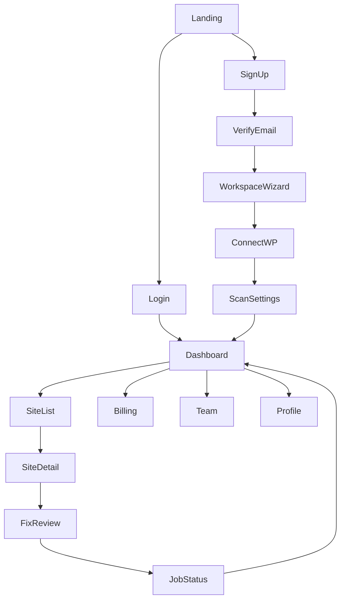

# AI-Growth-OS — Application Flow (MVP)

| Field | Value |
|-------|--------|
| **Product** | AI Growth Operating System (AI-Growth-OS) |
| **Document** | APP-FLOW-MVP |
| **Status** | Draft v0.1 |
| **Horizon** | Next 90 days (Phase A) |
| **Companion** | [PRD](./PRD.md) · [TRD-MVP](./TRD-MVP.md) · [APP-FLOW-VISION](./APP-FLOW-VISION.md) |

> **UI rule:** This document is the **only** authoritative screen/journey spec for MVP. Do not implement Auth0/SSO, DNS-first site verification, Argo/CI deploy UIs, Kafka webhooks, API keys, SMS SLA, or 5-role RBAC. Deploy means **WordPress patch apply + verify + rollback**. Goal-first Growth Brain UX lives in [APP-FLOW-VISION](./APP-FLOW-VISION.md).

MVP mental model (honest for Phase A):

```text
Connect WP → Audit → Fix → Deploy → Verify → Monitor
```

Copy and empty states may *hint* at growth outcomes; do not ship a fake “+leads” planner.

---

## 1. Screen inventory (Must)

| Screen | Purpose |
|--------|---------|
| Landing | Public marketing; CTA to sign-up / login |
| Login | Email + password (Clerk or Auth.js) |
| Sign-up | Account creation (no SSO required) |
| Email verification | Confirm email when provider requires it; resend option |
| Onboarding – Workspace | Create first workspace/org; light plan selection (Free/Starter/Agency) |
| Onboarding – Connect Website | Choose WordPress / GitHub / ZIP / Live URL; health verify |
| Onboarding – Scan settings | Frequency (default weekly); safe auto-apply toggle |
| Dashboard (Home) | Multi-site health, recent jobs, Run scan |
| Site list | Domains with status badges |
| Site detail | Issues from latest scan, scan history (proposals Phase 4+) |
| Fix review modal | Diff, `change_class`, approve / reject (Phase 4+) |
| Job / scan status | Queued → Crawling → Auditing → Done \| Failed |
| Billing & usage | Plan, meters (sites/scans), Stripe portal |
| Team (minimal) | Invite member; roles `owner` \| `member` only |
| Profile | Name, email, logout |
| Empty states | No sites / no issues CTAs |
| Loading skeletons | Shared while data loads |
| 404 / 500 | Friendly recovery |

### Out of MVP (do not build)

Webhook management, full Alert Center, API Keys, deep notification/SLA settings, Owner/Admin/Editor/Viewer/Auditor matrix, support ticket system, full help KB, Growth Strategy, Autonomous Mode page, Learning/Business revenue dashboards, DNS TXT as primary connect path, CI/CD pipeline confirmation.

---

## 2. Primary navigation



| Zone | Access |
|------|--------|
| Public | Landing, Login, Sign-up, Verify email |
| Onboard | Workspace → Connect WP → Scan settings (once per new workspace / until first site) |
| Main | Dashboard and sidebar: Sites, Billing, Team, Profile |

Auth: session/JWT after login. Roles: `owner` | `member`.

---

## 3. Key user journeys

### 3.1 First-time signup and onboarding

| Step | User action | System reaction |
|------|-------------|-----------------|
| 1 | Sign up (email/password) | Create user (Clerk/Auth.js); may require email verify |
| 2 | Verify email if prompted | Mark verified; issue session |
| 3 | Create workspace name; pick Free/Starter/Agency | `organizations` + plan stub; Stripe only if paid |
| 4 | Optional: invite teammate as `member` | Invitation email; pending membership |
| 5 | Connect WordPress (plugin install + token **or** Application Password) | Call plugin `health`; store encrypted credentials |
| 6 | Health OK | Enqueue first `job_run` (crawl→…); UI: “First audit started” |
| 7 | Scan settings: weekly default; optional safe auto-apply | Persist site settings |
| 8 | Land on Dashboard | Site card shows job in progress or pending results |

**Not in this journey:** Auth0, DNS TXT ownership as primary gate, Argo CD.

### 3.2 Approve AI fix and deploy (core)

| Step | User action | System reaction |
|------|-------------|-----------------|
| 1 | Open Site detail after audit | Issues + proposals listed |
| 2 | Open Fix review | Diff, `change_class` (safe / approve), risk/notes |
| 3 | Approve (or safe auto-apply already queued) | Patch(es) marked approved; deploy job enqueued (BullMQ) |
| 4 | Confirm apply (summary of patches — **not** CI/CD steps) | `apply_patch` via WP plugin |
| 5 | Job status page | Progress: deploying → verifying |
| 6 | Verify re-fetches live HTML | Match `after` → `done`; mismatch → `failed` + rollback CTA (or auto-rollback if configured for safe-class) |
| 7 | Return to Site detail / Dashboard | Health badge updates; immutable audit log entry |

### 3.3 Safe auto-apply

| Step | User action | System reaction |
|------|-------------|-----------------|
| 1 | Enable “Auto-apply safe fixes” in scan settings | Only `change_class=safe` may skip awaiting_approval |
| 2 | Audit completes | Safe proposals auto-queue deploy; approve-class still needs human |
| 3 | User reviews Job status / history | Full before/after retained for rollback |

---

## 4. Job status — lightweight agent progress

Show the PRD/TRD state machine as a checklist (trust UI), not a multi-agent ops console:

```text
Queued → Crawling → Auditing → Proposing
  → Awaiting approval (if needed) → Deploying → Verifying → Done | Failed
```

Each step: pending / running / done / failed. Failed step shows error + Retry where allowed (crawl/audit retry; deploy only after `health` OK).

---

## 5. Edge cases and recovery (MVP)

| Context | UI | Recovery |
|---------|-----|----------|
| Session expired | Overlay → Login | Preserve return URL |
| Email verify link invalid | Banner + Resend | New email |
| WP connect / health fail | Inline error on Connect | Fix plugin/credentials; retest health |
| Crawl / scan timeout | Site detail red last-scan | Retry scan |
| LLM rate limit | Toast; try backup model | Fallback Fireworks/OpenAI; else retry later / upgrade |
| Verify fail after deploy | Job status red + diff | Rollback (one-click) |
| Rollback fail | Error + support CTA | Retry rollback; do not claim container/K8s errors |
| Payment declined | Billing modal | Update card via Stripe |
| Empty — no sites | Illustration + Connect WordPress | Open connect wizard |
| Empty — no issues | “Looking good” + Run audit | Trigger job |
| Rate limit / AI budget | Toast + Upgrade | Billing modal |
| Stale concurrent approve | Banner: already applied | Refresh proposals |
| 404 / 500 | Friendly pages | Dashboard / Retry; Sentry on 500 |
| Loading | Skeletons | Replace on API resolve |

**Deferred edge UIs:** API key 401, webhook 504, static-analysis `eval` gates, “containers unhealthy.”

---

## 6. Copy guidance

- Prefer “Apply to WordPress” / “Verify live site” / “Rollback” over “CI/CD,” “pipeline,” “cluster.”
- Dashboard subtitle may say “Grow visibility safely” without inventing revenue numbers.
- Safe auto-apply helper text: lists meta, schema, `llms.txt`, empty alts only.

---

## 7. Alignment

| Source | Constraint honored |
|--------|-------------------|
| PRD §8 | Must screens only; owner/member; WP loop |
| TRD-MVP | BullMQ jobs; plugin apply/rollback; no Kafka/Argo |
| APP-FLOW-VISION | Referenced, not implemented |

---

## Document control

| Version | Date | Notes |
|---------|------|--------|
| v0.1 | 2026-07-29 | MVP app flow; split from enterprise flow draft |
