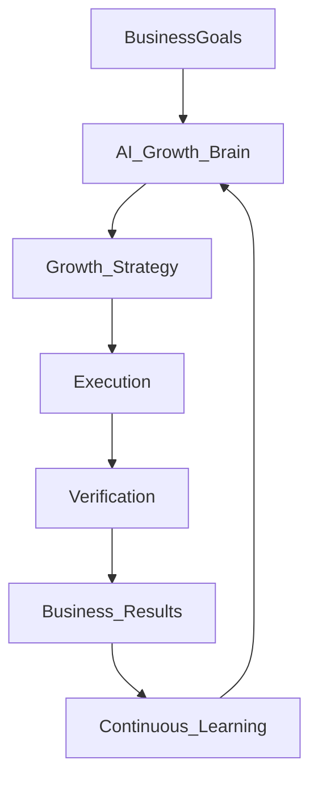

# AI-Growth-OS — Application Flow (Vision)

| Field | Value |
|-------|--------|
| **Product** | AI Growth Operating System (AI-Growth-OS) |
| **Document** | APP-FLOW-VISION |
| **Status** | Draft v0.1 |
| **Horizon** | Phase C–D UX (post write-loop trust) |
| **Companion** | [PRD](./PRD.md) · [TRD-SCALE](./TRD-SCALE.md) · [APP-FLOW-MVP](./APP-FLOW-MVP.md) |

> **UI rule:** Reference-only until Growth Brain / analytics dependencies exist. **Do not** replace [APP-FLOW-MVP](./APP-FLOW-MVP.md) screens in Phase A. This doc defines the long-term mental model: users set **business goals**; AI plans, executes, verifies, and learns.

---

## 1. Why this exists

Enterprise flow drafts and reviews correctly push the product from:

```text
Dashboard → Site → Audit → Fix → Deploy
```

toward:

```text
Business goals → AI Growth Brain → Growth plan → Execution
  → Verification → Business results → Continuous learning
```

That matches the **AI Growth Operating System** category. It must not ship before the WordPress (then multi-CMS) **trust loop** works — otherwise “estimated lead gain” is theater.

---

## 2. Core vision flow



Dashboard becomes the place users **monitor the AI**, not manually drive every optimization. Power users keep Site Detail from MVP as an advanced surface.

---

## 3. Future onboarding — goal picker

Replace “add site → configure scan” as the *emotional* center with:

```text
What do you want?
  ○ More leads
  ○ More sales
  ○ More traffic
  ○ Better AI visibility
  ○ Local customers
  ○ Faster website
```

Then: connect property (WP / later Shopify etc.) → Brain translates goals into a technical roadmap. Site connect remains required; goals come first in the narrative.

---

## 4. Future screens

| Screen | Purpose |
|--------|---------|
| Goal picker onboarding | Capture outcomes before deep SEO chrome |
| AI Growth Strategy | Today’s priorities, predicted impact, estimated traffic/lead ranges, time estimate, **Start Execution** |
| Automation level | Manual / Assisted / Automatic / Autonomous — maps to `change_class` + approval policy |
| Agent timeline | Full crawler → auditor → content → deploy → verify → learning (ops transparency) |
| Learning dashboard | Best/worst changes, recovered rankings, confidence, experiments, rollback history |
| Business dashboard | Citations, conversions, revenue/leads (connected sources only) |
| AI Memory | Prior audits, deploys, successes/failures, ranking deltas → future recommendations |

### Growth Strategy (example content)

```text
Week 1 — Fix Core Web Vitals (approve-class / later)
Week 2 — FAQ schema (safe / approve)
Week 3 — AI visibility / llms.txt + citations
Week 4 — Local SEO improvements
```

User starts execution; system uses existing deploy/verify machinery from MVP.

### Automation levels

| Level | Behavior |
|-------|----------|
| Manual | Propose only; every apply needs click |
| Assisted | Safe-class auto; approve-class needs human |
| Automatic | Safe + selected approve types with policy |
| Autonomous | Broader auto within hard blocks (no theme/JS deletes); still logs + rollback |

---

## 5. Dependency gate

Do not staff VISION UI as Must until:

1. MVP write loop trusted (deploy ≥95%, rollback proven) — [APP-FLOW-MVP](./APP-FLOW-MVP.md) / [TRD-MVP](./TRD-MVP.md)
2. Multi-site agency usage validates demand
3. Analytics/CRM (or equivalent) connectors for any **business** KPI claims — [TRD-SCALE](./TRD-SCALE.md) Growth Brain
4. Experiment / memory store for learning surfaces

Align with PRD Phase D and TRD-SCALE §4.

---

## 6. Migration from MVP UI

| MVP surface | Vision overlay |
|-------------|----------------|
| Dashboard (site health) | Business + Strategy home for Assisted/Autonomous tenants |
| Site detail | Power-user / debug; linked from strategy tasks |
| Job status checklist | Expands to full Agent timeline |
| Scan settings auto-apply | Becomes Automation level page |
| Audit history | Feeds Learning + AI Memory |

**Strangler UX:** add Strategy as optional home behind flag; default remains MVP Dashboard until Brain quality bar is met.

---

## 7. What not to promise in UI copy

- Guaranteed “+30% leads” or fixed revenue lift
- Business metrics without connected data sources
- Autonomous mode that edits theme/JS/CSS or fakes EEAT/backlinks

---

## Document control

| Version | Date | Notes |
|---------|------|--------|
| v0.1 | 2026-07-29 | Vision app flow; Growth Brain mental model; MVP remains authoritative |
