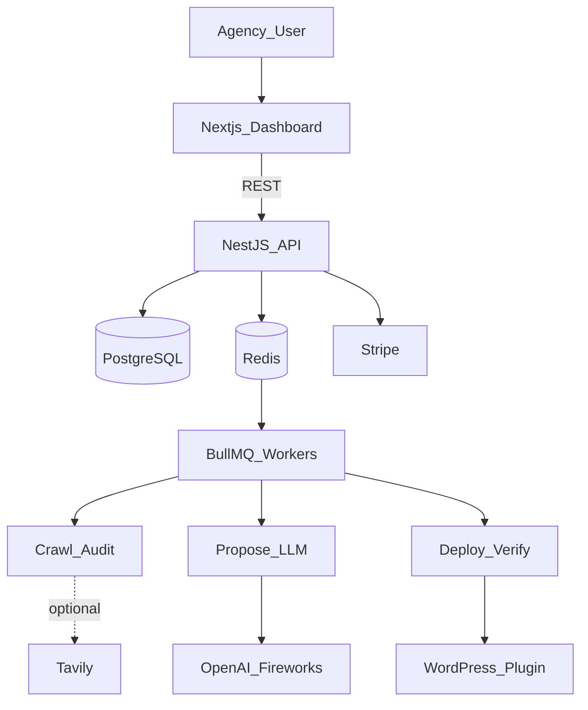
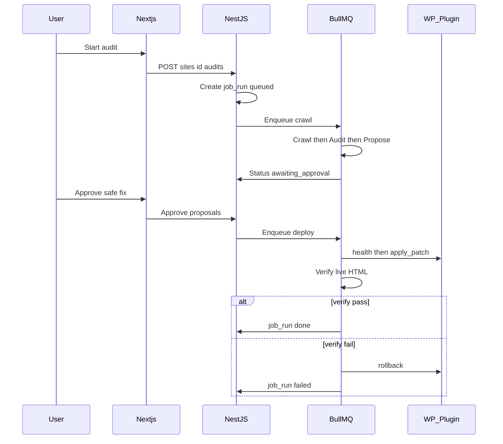

# AI-Growth-OS — High-Level Design (MVP)

| Field | Value |
|-------|--------|
| **Product** | AI Growth Operating System (AI-Growth-OS) |
| **Document** | HLD-MVP |
| **Status** | Draft v0.1 |
| **Horizon** | Phase A (next 90 days) |
| **Audience** | Engineering leads, AI coding assistants, investors (architecture skim) |
| **Companion** | [TRD-MVP](./TRD-MVP.md) · [LLD-MVP](./LLD-MVP.md) · [HLD-SCALE](./HLD-SCALE.md) |

> **Design rule:** This HLD is the **authoritative** high-level architecture for Phase A. Implement details via [LLD-MVP](./LLD-MVP.md). Do not substitute microservices, Kafka, Argo CD, or Kubernetes for the MVP closed loop.

---

## 1. Goals and non-goals

### Goals

Deliver a **modular monolith** that continuously:

```text
Connect WordPress → Crawl → Audit → Propose → Approve / safe-auto
  → Deploy (permanent CMS write) → Verify → Rollback → Re-audit
```

for multi-tenant agency **organizations** (`owner` | `member`).

### Non-goals (MVP)

- Kubernetes, Kafka, gRPC mesh, Istio, Argo CD, multi-region
- GraphQL, Pinecone, Vault as required dependencies
- Growth Brain runtime, multi-CMS adapters, SSO/SOC2
- “Agent microservices” replacing a single job state machine

---

## 2. Context diagram



**External systems:** WordPress (customer), OpenAI/Fireworks, Stripe, optional Tavily.  
**System of record:** PostgreSQL ([SCHEMA-MVP](./SCHEMA-MVP.md)).  
**Job payloads are not SoT** — they reference `job_runs.id`.

---

## 3. Architectural style

| Choice | Rationale |
|--------|-----------|
| Modular monolith | Fast delivery, one deploy artifact, easy debugging for trust/rollback |
| NestJS domain modules | Clear boundaries without network hops |
| BullMQ workers | Long crawl/deploy without blocking HTTP |
| WP plugin adapter | Permanent writes + rollback — product USP |
| Single region | Enough for pilots; escape hatch in [HLD-SCALE](./HLD-SCALE.md) |

**Why not microservices now:** Cross-service transactions for patch apply + verify increase failure modes before product-market fit. Extract workers later when SLOs demand it.

---

## 4. Logical modules

| Module | Responsibility |
|--------|----------------|
| **Identity** | Auth, users, org membership |
| **Sites** | Domains, CMS type, encrypted credentials, settings |
| **Orchestrator** | `job_runs` lifecycle / transitions |
| **Crawl** | Sitemap-capped fetch, pages, snapshots |
| **Audit** | Deterministic SEO/AEO-readiness rules → issues |
| **Propose** | Rules + LLM → proposals + patches |
| **Deploy** | WP `apply_patch`, idempotent apply |
| **Verify** | Live re-fetch vs `after_state` |
| **Billing** | Stripe stub, usage metering |
| **WP Adapter** | Plugin client (health / apply / rollback) |

UI modules map to [APP-FLOW-MVP](./APP-FLOW-MVP.md); visuals to [UI-UX-BRIEF-MVP](./UI-UX-BRIEF-MVP.md).

---

## 5. End-to-end sequence



---

## 6. Job state machine

```text
queued → crawling → auditing → proposing → awaiting_approval
      → deploying → verifying → done | failed
```

Safe auto-apply: if site `safe_auto_apply` and all queued patches are `change_class=safe`, skip `awaiting_approval` and enqueue deploy.

Orchestrator owns transitions; workers perform side effects then report events back (see LLD transition table).

---

## 7. Trust model (first-class)

| Concern | HLD treatment |
|---------|----------------|
| **change_class** | `safe` \| `approve` \| `blocked` — server enforced |
| **Diff** | UI shows before/after before apply |
| **Permanent write** | WP plugin, not JS overlay |
| **Verify** | Mandatory after apply |
| **Rollback** | Restore `before_state`; metric for pilots |

Trust > autonomy: clever agents never bypass these controls in MVP.

---

## 8. Non-functional requirements

| NFR | MVP target |
|-----|------------|
| Scale | Tens–low hundreds of sites |
| Time-to-first audit results | ~5–10 min mid-size site (URL cap) |
| Deploy success | ≥ 95% |
| Rollback | Must pass staging E2E |
| Availability | Single region, best-effort |
| Observability | Structured logs + Sentry |
| Security | Org isolation in app; encrypted WP secrets |

---

## 9. Deployment topology (MVP)

```text
[Browser]
    → Next.js (Vercel/Fly/Railway)
    → NestJS API (+ worker process or in-process BullMQ)
    → Managed Postgres
    → Managed Redis
Customer WordPress ← HTTPS plugin calls from workers
```

No cluster mesh. CI: lint/typecheck/test; plugin distributed as private zip for pilots.

---

## 10. Out of scope

Growth Brain as live planner, multi-CMS, service mesh, vector DB, enterprise RBAC matrix — [HLD-SCALE](./HLD-SCALE.md).

---

## Document control

| Version | Date | Notes |
|---------|------|--------|
| v0.1 | 2026-07-29 | MVP HLD; modular monolith + WP trust loop |
