# AI-Growth-OS — Implementation Plan (MVP)

| Field | Value |
|-------|--------|
| **Product** | AI Growth Operating System (AI-Growth-OS) |
| **Document** | IMPL-MVP |
| **Status** | **Phases 0–8 shipped.** Core MVP + automation/billing stub + pilot readiness |
| **Horizon** | Next ~90 days / ~12 weeks |
| **Audience** | Engineering, QA, Cursor / AI coding assistants |

> **Execution rule:** This is the **only** build sequence for Phase A. Do **not** follow enterprise plans that put Argo CD, Kubernetes, Nx, or full RBAC before the WordPress trust loop. Authority: [PRD §8](./PRD.md), [TRD-MVP](./TRD-MVP.md), [SCHEMA-MVP](./SCHEMA-MVP.md), [APP-FLOW-MVP](./APP-FLOW-MVP.md), [UI-UX-BRIEF-MVP](./UI-UX-BRIEF-MVP.md). Post-pilot work: [IMPL-SCALE](./IMPL-SCALE.md).

> **Progress rule:** Measure by customer-visible capability. Latest verified: **Mission Control** answers “what should I do today?” plus connect → scan → propose → deploy → verify → rollback.

> **Founder freeze (2026-08-04):** Do **not** start Phase 7 (automation/billing) until Track A validation gates below are met. Prefer polish, onboarding, demo assets, and real users over new core features.

### Validation gate before Phase 7

Start Phase 7 only after (approx.):

| Signal | Target |
|--------|--------|
| Real users / businesses | ≥ 5–10 |
| Website scans completed | ≥ 100 |
| AI proposals approved | ≥ 50 |
| Deployments | ≥ 20 |
| User ask | “Can this run automatically every week?” (or equivalent) |

**Track A (now):** UX polish, bugs, onboarding, proposal quality, deploy reliability metrics, demo sites, marketing site, docs, demo video, beta recruit.  
**Track B (later):** Phase 7 schedule + safe auto-apply + Stripe — only what users pull for.

---

## 1. Goal and non-goals

### Goal

Ship a **platform-agnostic Connect Website** layer with four MVP connection methods, then the WordPress full write loop as the deepest automation path:

```text
Connect (WP | GitHub | ZIP | Live URL)
  → Audit → Propose → Approve / safe-auto
  → Deploy (when adapter supports) → Verify → Rollback → Weekly re-audit
```

for agency workspaces (`owner` | `member`), with Stripe billing stub.

**MVP connection methods**

| Type | Analyze | Deploy | Verify | Rollback |
|------|---------|--------|--------|----------|
| WordPress plugin | ✅ | ✅ | ✅ | ✅ |
| GitHub repository | ✅ | ✅ (PR path) | ✅ | ✅ (revert) |
| ZIP upload | ✅ | download later | — | — |
| Live website URL | ✅ | — | ✅ reachability | — |

### Non-goals (MVP)

- Argo CD, Kubernetes, Nx monorepo requirement
- Shopify / Webflow / Wix / Squarespace / Vercel-host OAuth (Scale)
- Growth Brain / “increase leads 30%”
- SSO, SOC2, api_keys, webhook product, 5+ role RBAC
- Kafka, Pinecone, Timescale as dependencies
### Team (capital-efficient)

1–2 full-stack engineers + WordPress plugin capability (founder or contractor). Cursor-assisted delivery is assumed. A six-role enterprise squad is **not** a prerequisite.

### Repo layout (no Nx required)

```text
apps/web/              # Next.js — APP-FLOW-MVP + UI-UX-BRIEF-MVP
apps/api/              # NestJS API + BullMQ worker entry
packages/shared/       # DTOs, change_class, patch types
wordpress-plugin/      # health, apply_patch, rollback
docs/                  # PRD, TRD, schema, flows, briefs, this plan
```

---

## 2. Product definition of done

| Criterion | Target |
|-----------|--------|
| Happy path | WP connect → first audit → approve safe fix → live verify pass |
| Rollback | One-click restore `before_state`; works in staging tests |
| Deploy success | ≥ 95% on pilot sites |
| Schedule | Weekly job per site |
| Billing | Free / Starter / Agency stub + `usage_events` |
| Pilots | 2–5 agencies using multi-site workspace |

---

## 3. Build sequence overview

```mermaid
flowchart LR
  P0[Phase0_Scaffold] --> P1[Phase1_Auth_Org]
  P1 --> P2[Phase2_WP_Connect]
  P2 --> P3[Phase3_Crawl_Audit]
  P3 --> P4[Phase4_Propose_Patch]
  P4 --> P5[Phase5_WP_Deploy_Verify]
  P5 --> P6[Phase6_Dashboard_UI]
  P6 --> P7[Phase7_Schedule_Billing]
  P7 --> P8[Phase8_Pilot_Ready]
```



Phases 5–6 may overlap (API deploy before polish UI), but **Phase 5 is WP plugin deploy — never Argo.**

| Phase | Weeks (hint) | Focus | Exit criteria |
|-------|--------------|--------|----------------|
| 0 | 1 | Scaffold, Postgres, Redis, env, CI lint stub | `web` + `api` boot locally |
| 1 | 2 | Auth, organizations, memberships | Create org; invite member |
| 2 | 3–4 | Sites, credentials, plugin `health` | Health OK; secrets encrypted |
| 3 | 4–6 | job_runs crawl → audit → issues | Issues on Site detail API |
| 4 | 6–7 | LLM proposals + patches | Diff-ready proposals |
| 5 | 7–9 | apply / verify / rollback | Live HTML match; rollback OK |
| 6 | 8–10 | Dashboard, site UI, job stepper | APP-FLOW-MVP Must screens |
| 7 | 10–11 | Weekly schedule, safe auto-apply, Stripe | Metering + paid stub |
| 8 | 11–12 | Sentry, plugin zip, runbooks, pilots | 2–5 agency pilots |

---

## 4. Phase checklists

### Phase 0 — Foundations

- [x] Init monorepo (`apps/web`, `apps/api`, `packages/shared`)
- [x] Postgres 15 + Redis locally (Docker Compose OK)
- [x] Env templates: `DATABASE_URL`, `REDIS_URL`, `ENCRYPTION_KEY`
- [x] NestJS hello + Next.js hello; shared package wired
- [x] CI: lint + typecheck stub
- [x] Prisma schema bootstrap stub (`apps/api/prisma`) — full SCHEMA-MVP models in Phase 1

**Tables:** bootstrap only (or empty migration runner).

### Phase 1 — Auth and core tenancy

- [x] Auth — email/password + JWT (`POST /auth/signup`, `/auth/login`, `/auth/me`)
- [x] CRUD organization; `memberships` with `owner` | `member`
- [x] JWT + memberships used for tenant checks (org invite/list members require membership)

**APIs:** `POST /auth/*`, `POST /organizations`, `POST /organizations/:id/invites`  
**Tables:** `users`, `organizations`, `memberships`  
**Web:** `/signup`, `/login`, `/onboarding`, authenticated `/dashboard`

### Phase 2 — Workspace sites and connections

- [x] Site CRUD with `connection_type`: `wordpress` | `github` | `zip` | `url_audit`
- [x] Connection adapter layer (shared capabilities interface)
- [x] WordPress: plugin health + encrypted credentials
- [x] GitHub: repo + PAT verify (PR deploy path later in pipeline)
- [x] ZIP: upload, framework detect, encrypted storage key
- [x] Live URL: reachability check (instant read-only audit on-ramp)
- [x] Connect Website UI (chooser + type-specific wizard)

**APIs:** `GET /sites/connection-types`, `POST /sites`, `POST /sites/:id/connect`, `POST /sites/:id/upload`, `GET /sites/:id/health`  
**Tables:** `sites` (+ `connection_type`), `credentials`  
**Local:** `MOCK_WP_HEALTH=1` for WP without real plugin; ZIP files under `apps/api/storage/zips/`
### Phase 3 — Crawl and scan pipeline

- [x] `POST /sites/:id/audits` → enqueue BullMQ `scan` job
- [x] States: `queued` → `crawling` → `auditing` → `done` | `failed` (Phase 3 stops before `proposing`)
- [x] Universal ContentResolver: WordPress / Live URL / GitHub / ZIP
- [x] Sitemap-capped crawl (50); robots.txt respect for live HTTP
- [x] Store `crawls` / `pages` / `issues` (+ thin `audit_logs`)
- [x] Deterministic auditors (title, meta, H1, schema, alt, canonical, sitemap, robots, llms.txt, HTTPS, etc.)
- [x] Site detail + job status UI

**Queues:** `scan` (crawl+audit stages via `job_runs.status`)  
**Tables:** `job_runs`, `crawls`, `pages`, `issues`, `audit_logs`  
**Retry:** BullMQ 3× on transient failures  
**APIs:** `POST /sites/:id/audits`, `GET /job-runs/:id`, `GET /sites/:id/job-runs|issues|pages`  
**Web:** `/job-runs/[id]`, `/sites/[id]`, dashboard Run scan


### Phase 4 — AI proposals and patches

- [x] Rule engine (+ optional OpenAI polish) for title / meta description / FAQ schema only
- [x] `proposals` with lifecycle `draft|pending_review|approved|rejected|superseded`
- [x] Server-side `confidence` + `change_class` (`safe`|`approve`|`blocked`); `impact_type`
- [x] `proposal_events` audit trail; approve creates **draft** `patches` (not applied)
- [x] Site detail proposal cards: before/after, reasoning, Approve / Reject
- [x] BullMQ `propose` after scan; job → `awaiting_approval` when pending

**Queues:** `propose`  
**Tables:** `proposals`, `proposal_events`, `patches`  
**Out of scope:** live deploy / website mutation

### Phase 5 — Deployment service (WordPress — not Argo)

- [x] Plugin: `POST apply_patch`, `POST rollback`
- [x] Deploy worker: health check → apply → **no blind retry**
- [x] Verify: re-fetch live HTML / mock HTML; compare to `after_state`
- [x] On mismatch: auto-rollback + Mission Timeline events
- [x] Idempotency on `patch_id` + action
- [x] Tables: `deployments`, `deployment_events`
- [x] APIs: `POST /sites/:id/deploy`, `GET /deployments/:id` (timeline), `POST /deployments/:id/rollback`

**Queues:** `deploy`  
**Tables:** `deployments`, `deployment_events`  
**Forbidden:** `git_commit_sha`, `kubernetes_cluster_id`, Argo CD

**Supported deploy types only:** meta title, meta description, FAQ schema

### Phase 6 — Dashboard MVP UI

- [x] Mission Control home: KPIs, Growth Pulse, activity timeline, priority tasks
- [x] Trust Indicators on deployment Mission Timeline
- [x] Website status cards (health / SEO / AI visibility / pending)
- [x] Quick actions: Connect, Run Scan, Review, Deploy Approved
- [x] Global search (sites, proposals, deployments, issues)
- [x] Actionable notification strip (no worker noise)
- [x] App shell + light/dark theme (`class` strategy)
- [x] Responsive layout; Plus Jakarta Sans / IBM Plex Mono tokens

**APIs:** `GET /organizations/:id/mission-control`, `GET /organizations/:id/search`

### Phase 7 — Schedule, auto-apply, billing

- [x] BullMQ weekly job scheduler per site (`schedule: weekly|manual`)
- [x] Safe auto-apply toggle → approve+deploy `safe` only
- [x] Stripe Checkout + Customer Portal (real keys) or local stub
- [x] `subscriptions` + `usage_events` (scans, AI generations)
- [ ] Weekly AI report / email summary (deferred until pilots ask)

**APIs:** `GET/POST .../billing`, `POST /billing/webhook`, `GET .../usage`

### Phase 8 — Pilot readiness

- [x] Sentry hooks (API `SENTRY_DSN`, web `NEXT_PUBLIC_SENTRY_DSN`)
- [x] Private plugin zip + install docs
- [x] Staging WordPress compose (`npm run wp:up`)
- [x] Runbook: [PILOT-RUNBOOK.md](./PILOT-RUNBOOK.md)
- [x] Product analytics: `GET .../pilot-metrics` (approval %, deploy %, WAU)
- [ ] Onboard 2–5 external pilot agencies (process, not code)

---

## 5. Testing bar

| Layer | Must cover |
|-------|------------|
| Unit | `change_class` guards; patch idempotency keys |
| Integration | Staging WP: apply → verify pass; apply → verify fail → rollback |
| API | Org isolation (member cannot access other org sites) |
| Load (light) | Tens of sites; queue depth monitored |

Do not ship Phase 8 without a green apply→verify→rollback path on staging WP.

---

## 6. Risks and mitigations

| Risk | Mitigation |
|------|------------|
| Yoast vs Rank Math meta keys | Compatibility map in plugin; detect SEO plugin in `health` |
| Agencies fear auto-write | Default safe auto-apply **off**; mandatory diff; easy rollback |
| Plugin install friction | One-page zip + Application Password fallback |
| LLM cost / quality | Deterministic audit first; caps; Fireworks for bulk |
| Scope creep (Argo, Growth Brain) | This doc + PRD Won’t list in every PR review |

---

## 7. Explicit backlog (not MVP)

Growth Brain, Shopify/Webflow, AI citations productization, api_keys, webhooks, SSO, RLS, pgvector, Kafka, K8s, Nx — see [IMPL-SCALE](./IMPL-SCALE.md).

---

## Document control

| Version | Date | Notes |
|---------|------|--------|
| v0.1 | 2026-07-29 | MVP implementation plan; WP deploy replaces Argo phase |
| v0.2 | 2026-08-04 | Phases 0–3 complete; multi-connect + universal scanner verified; Phase 4 next |
| v0.3 | 2026-08-04 | Phase 4 AI proposals (lifecycle, events, draft patches); no deploy |
| v0.4 | 2026-08-04 | Phase 5 trust loop: WP apply/verify/rollback + Mission Timeline |
| v0.5 | 2026-08-04 | Phase 6 Mission Control dashboard, search, trust strip, dark mode |
| v0.6 | 2026-08-04 | Core MVP freeze; Phase 7 gated on private beta validation |
