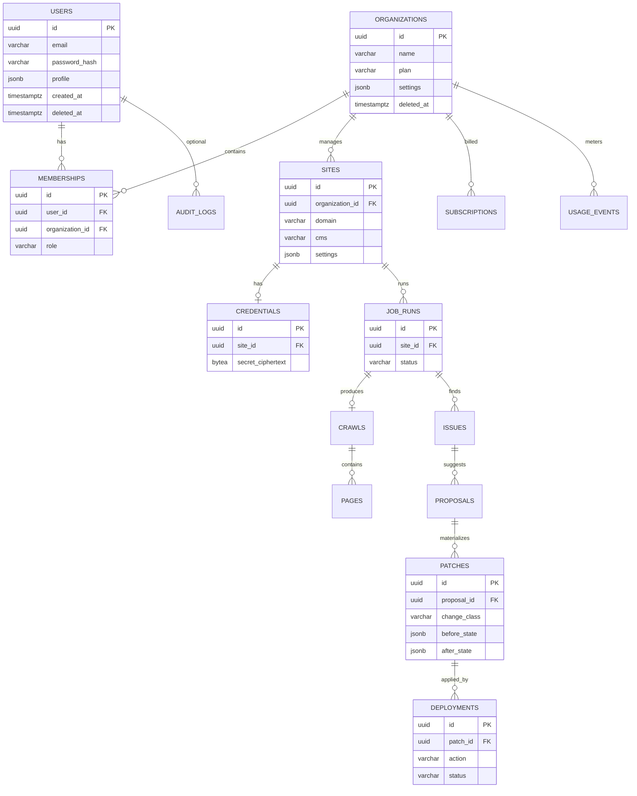

# AI-Growth-OS — Database Schema (MVP)

| Field | Value |
|-------|--------|
| **Product** | AI Growth Operating System (AI-Growth-OS) |
| **Document** | SCHEMA-MVP |
| **Status** | Draft v0.1 |
| **Database** | PostgreSQL 15 (plain — no Timescale/pgvector required) |
| **Companion** | [TRD-MVP](./TRD-MVP.md) · [SCHEMA-SCALE](./SCHEMA-SCALE.md) |

> **DDL rule:** This schema is the **only** authoritative data model for Phase A. Prisma/Drizzle/SQL migrations must follow it. Growth goals, embeddings, full RBAC, api_keys, webhooks, and K8s/git deploy fields live in [SCHEMA-SCALE](./SCHEMA-SCALE.md).

**Conventions:** snake_case; UUID PKs (`gen_random_uuid()` or `uuid_generate_v4()`); `timestamptz` UTC; soft-delete via `deleted_at` on user-visible entities; JSONB for flexible payloads.

**Product synonym:** UI may say “workspace”; table name is `organizations`.

**Async:** Redis + BullMQ reference `job_runs.id` — job payloads are not a second source of truth.

---

## 1. Design goals

```text
Organization
  → Sites (WordPress)
    → Job runs (state machine)
      → Crawls / pages
      → Issues → Proposals → Patches
        → Deployments (apply | rollback)
```

Support **safe auto-apply** via `patches.change_class` and immutable `before` / `after` for rollback. No `git_commit_sha` / `kubernetes_cluster_id`.

---

## 2. ER diagram



---

## 3. Table dictionary

### 3.1 Identity and tenancy

| Table | Column | Type | Notes |
|-------|--------|------|--------|
| **users** | id | uuid PK | |
| | email | varchar(255) UNIQUE NOT NULL | Plain unique email (not pgp-encrypted) |
| | password_hash | varchar(255) | Nullable if Clerk/Auth.js external id only |
| | auth_subject | varchar(255) | Optional external IdP subject |
| | profile | jsonb | name, avatar |
| | created_at / updated_at / deleted_at | timestamptz | Soft-delete |
| **organizations** | id | uuid PK | Agency workspace |
| | name | varchar(150) NOT NULL | |
| | plan | varchar(20) | `free` \| `starter` \| `agency` |
| | settings | jsonb | Feature toggles |
| | stripe_customer_id | varchar(255) | Nullable |
| | created_at / updated_at / deleted_at | timestamptz | |
| **memberships** | id | uuid PK | |
| | user_id | uuid FK → users | ON DELETE CASCADE |
| | organization_id | uuid FK → organizations | ON DELETE CASCADE |
| | role | varchar(20) NOT NULL | **`owner` \| `member` only** |
| | created_at | timestamptz | |
| | | | UNIQUE(user_id, organization_id) |

### 3.2 Sites and credentials

| Table | Column | Type | Notes |
|-------|--------|------|--------|
| **sites** | id | uuid PK | |
| | organization_id | uuid FK | ON DELETE CASCADE |
| | domain | varchar(255) NOT NULL | |
| | connection_type | enum | `wordpress` \| `github` \| `zip` \| `url_audit` |
| | cms | varchar(30) NOT NULL | Default `wordpress`; may mirror detected framework |
| | settings | jsonb | `{ "safe_auto_apply", "schedule", "base_url", "repo", "storage_key", … }` |
| | health_status | varchar(30) | last connection health |
| | created_at / updated_at / deleted_at | timestamptz | |
| | | | UNIQUE(organization_id, domain) WHERE deleted_at IS NULL |
| **credentials** | id | uuid PK | |
| | site_id | uuid FK UNIQUE | One credential set per site |
| | kind | varchar(30) | `plugin_token` \| `app_password` \| `github_token` \| `zip_storage` |
| | secret_ciphertext | bytea NOT NULL | App AES-GCM; key in env |
| | meta | jsonb | Non-secret (WP user login label, storage_key, …) |
| | created_at / updated_at | timestamptz | |

**audit_logs** (thin, Phase 3+): organization_id, actor_user_id, action, resource_type, resource_id, meta — used for connect/upload/scan-start.

Primary WP connect path is plugin/token — **not** DNS TXT verification as the schema centerpiece. GitHub/ZIP/URL are first-class connection types for the universal scanner.

### 3.3 Jobs, crawl, issues, proposals

| Table | Column | Type | Notes |
|-------|--------|------|--------|
| **job_runs** | id | uuid PK | |
| | site_id | uuid FK | ON DELETE CASCADE |
| | status | varchar(30) NOT NULL | See enum below |
| | error_code / error_message | varchar/text | Sanitized |
| | started_at / finished_at | timestamptz | |
| | created_at | timestamptz | |
| **crawls** | id | uuid PK | |
| | job_run_id | uuid FK | ON DELETE CASCADE |
| | page_count | int | |
| | snapshot_prefix | varchar(512) | S3/R2 key prefix (optional) |
| | created_at | timestamptz | |
| **pages** | id | uuid PK | |
| | crawl_id | uuid FK | ON DELETE CASCADE |
| | url | text NOT NULL | |
| | http_status | int | |
| | extracted | jsonb | title, metas, h1, schema flags, etc. |
| | created_at | timestamptz | |
| **issues** | id | uuid PK | |
| | job_run_id | uuid FK | ON DELETE CASCADE |
| | page_id | uuid FK | Nullable |
| | issue_type | varchar(50) | missing_title, no_schema, no_llms_txt, … |
| | severity | varchar(20) | info/low/medium/high/critical |
| | evidence | jsonb | |
| | resolved | boolean DEFAULT false | |
| | created_at | timestamptz | |
| **proposals** | id | uuid PK | |
| | issue_id | uuid FK | ON DELETE CASCADE |
| | source | varchar(20) | `rule` \| `llm` |
| | model | varchar(80) | Nullable |
| | prompt_version | varchar(40) | |
| | payload | jsonb | Suggested title/meta/schema/etc. |
| | status | varchar(20) | pending/approved/rejected/applied |
| | created_at / updated_at | timestamptz | |

**job_runs.status:**

```text
queued | crawling | auditing | proposing | awaiting_approval
| deploying | verifying | done | failed
```

### 3.4 Patches and deployments (trust core)

| Table | Column | Type | Notes |
|-------|--------|------|--------|
| **patches** | id | uuid PK | |
| | proposal_id | uuid FK | ON DELETE RESTRICT |
| | site_id | uuid FK | Denormalized for queries |
| | change_class | varchar(20) NOT NULL | `safe` \| `approve` \| `blocked` |
| | target | jsonb NOT NULL | `{ type, post_id, key, … }` |
| | before_state | jsonb NOT NULL | For rollback |
| | after_state | jsonb NOT NULL | Expected after apply |
| | created_at | timestamptz | |
| **deployments** | id | uuid PK | |
| | patch_id | uuid FK | ON DELETE RESTRICT |
| | job_run_id | uuid FK | Nullable |
| | action | varchar(20) NOT NULL | `apply` \| `rollback` |
| | status | varchar(20) NOT NULL | queued/in_progress/succeeded/failed |
| | verify_result | jsonb | Live fetch comparison |
| | error_message | text | |
| | started_at / completed_at | timestamptz | |
| | created_at | timestamptz | |

**No** `git_commit_sha`, **no** `kubernetes_cluster_id`.

#### Illustrative DDL (critical tables)

```sql
CREATE TABLE job_runs (
  id uuid PRIMARY KEY DEFAULT gen_random_uuid(),
  site_id uuid NOT NULL REFERENCES sites(id) ON DELETE CASCADE,
  status varchar(30) NOT NULL,
  error_code varchar(64),
  error_message text,
  started_at timestamptz,
  finished_at timestamptz,
  created_at timestamptz NOT NULL DEFAULT now()
);

CREATE TABLE patches (
  id uuid PRIMARY KEY DEFAULT gen_random_uuid(),
  proposal_id uuid NOT NULL REFERENCES proposals(id) ON DELETE RESTRICT,
  site_id uuid NOT NULL REFERENCES sites(id) ON DELETE CASCADE,
  change_class varchar(20) NOT NULL CHECK (change_class IN ('safe', 'approve', 'blocked')),
  target jsonb NOT NULL,
  before_state jsonb NOT NULL,
  after_state jsonb NOT NULL,
  created_at timestamptz NOT NULL DEFAULT now()
);

CREATE TABLE deployments (
  id uuid PRIMARY KEY DEFAULT gen_random_uuid(),
  patch_id uuid NOT NULL REFERENCES patches(id) ON DELETE RESTRICT,
  job_run_id uuid REFERENCES job_runs(id) ON DELETE SET NULL,
  action varchar(20) NOT NULL CHECK (action IN ('apply', 'rollback')),
  status varchar(20) NOT NULL,
  verify_result jsonb,
  error_message text,
  started_at timestamptz,
  completed_at timestamptz,
  created_at timestamptz NOT NULL DEFAULT now()
);
```

### 3.5 Billing and audit (thin)

| Table | Column | Type | Notes |
|-------|--------|------|--------|
| **subscriptions** | id | uuid PK | |
| | organization_id | uuid FK | |
| | plan | varchar(20) | free/starter/agency |
| | stripe_subscription_id | varchar(255) | Nullable |
| | active | boolean | |
| | period_start / period_end | date | Nullable |
| | created_at | timestamptz | |
| **usage_events** | id | uuid PK | |
| | organization_id | uuid FK | |
| | metric | varchar(50) | `scan`, `ai_generation`, `site_active` |
| | quantity | numeric | Default 1 |
| | meta | jsonb | site_id, job_run_id |
| | occurred_at | timestamptz | |
| **audit_logs** (optional) | id | uuid PK | Prefer append-only |
| | user_id | uuid FK | SET NULL |
| | organization_id | uuid FK | |
| | action | varchar(100) | e.g. fix.approve |
| | resource_type / resource_id | varchar / uuid | |
| | details | jsonb | Redacted |
| | performed_at | timestamptz | |

Invoices: **Stripe** is source of truth in MVP.

---

## 4. Indexes (MVP)

| Index | Purpose |
|-------|---------|
| UNIQUE (organization_id, domain) WHERE deleted_at IS NULL | Active sites |
| UNIQUE (user_id, organization_id) on memberships | One membership |
| INDEX job_runs (site_id, created_at DESC) | History |
| INDEX job_runs (status) | Workers |
| INDEX issues (job_run_id, severity) | Site detail |
| INDEX patches (site_id, change_class) | Safe batch |
| INDEX deployments (patch_id, created_at DESC) | Rollback UI |
| INDEX usage_events (organization_id, occurred_at) | Metering |

---

## 5. Security (MVP)

- Tenant isolation via application checks on `organization_id` (every query).
- Encrypt `credentials.secret_ciphertext`; never log raw tokens.
- Server enforces `change_class` (client cannot escalate blocked → safe).
- Defer: Postgres RLS, Vault, email field encryption, SOC2 evidence packs.

---

## 6. Out of schema (MVP)

agents, agent_tasks, api_keys, webhooks, notifications matrix, roles/permissions tables, vector_embeddings, growth_goals/tasks, ai_memory, experiments, ai_citations, ai_decisions, Timescale hypertables, Pinecone, git/k8s deploy columns.

---

## Document control

| Version | Date | Notes |
|---------|------|--------|
| v0.1 | 2026-07-29 | MVP schema aligned to TRD-MVP; WP patch trust loop |
