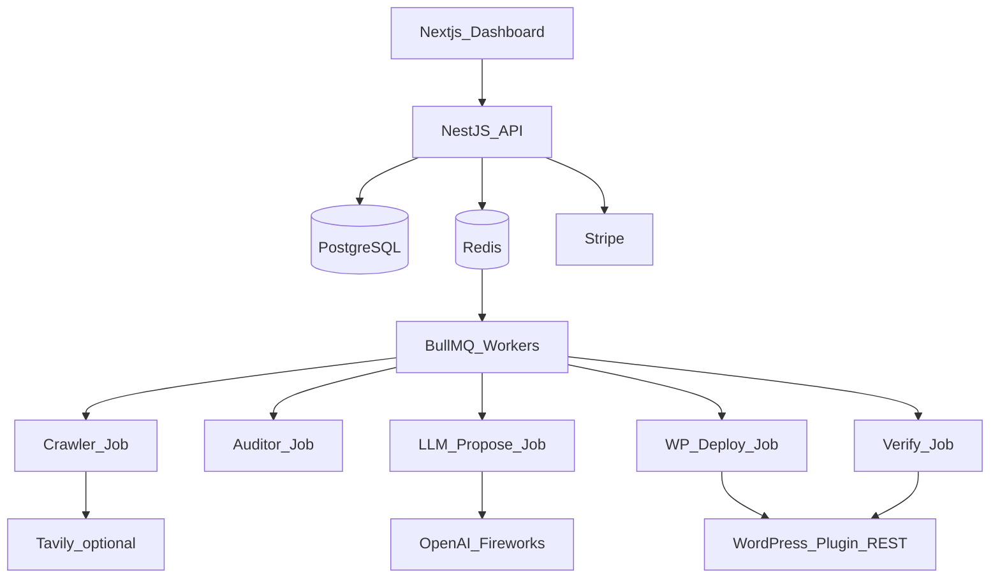

# AI-Growth-OS — Technical Requirements Document (MVP)

| Field | Value |
|-------|--------|
| **Product** | AI Growth Operating System (AI-Growth-OS) |
| **Document** | TRD-MVP (build now) |
| **Status** | Draft v0.1 |
| **Horizon** | Next 90 days (Phase A) |
| **Companion** | [PRD](./PRD.md) · [TRD-SCALE](./TRD-SCALE.md) |

> **Engineering rule:** This TRD is the **only** authoritative technical spec for MVP implementation. Do **not** implement Kubernetes, Kafka, gRPC, Istio, multi-region, Vault, ELK, Jaeger, Pinecone, or GraphQL from TRD-SCALE until scale triggers fire. Product scope must match [PRD Section 8](./PRD.md#8-mvp-scope-90-days).

**Positioning:** Unified visibility platform (SEO + AEO + GEO + local + AI visibility). SEO remains the foundation; AEO/GEO extend it.

---

## 1. Goals and non-goals

### Goals

- Agency workspaces with multi-site WordPress management (owner / member)
- Closed loop: crawl → audit → propose → approve/auto-safe → deploy → **verify** → rollback
- Permanent CMS writes via WordPress plugin/REST (not JS overlays)
- Weekly scheduled re-audit
- Stripe billing stub (sites + scans metering)
- Stack aligned to Cursor / small-team delivery: Next.js, NestJS, Postgres, Redis, BullMQ

### Non-goals (MVP)

From PRD Won’t list, plus infrastructure bans:

- Shopify / Webflow / Next.js site / GitHub deploy
- AI Growth Brain (“increase leads 30%”) autonomy
- Body-content auto-publish without approval; theme/JS/CSS mutation; mass redirects
- Backlinks / fake EEAT / review generation
- Multi-agent marketplace; SSO; SOC2; deep RBAC
- **Banned infra:** Kubernetes, Kafka, gRPC service mesh, Istio, ArgoCD, multi-region clusters, ELK, Jaeger, HashiCorp Vault, multi-cloud, Pinecone as a required dependency

---

## 2. Architecture overview

**Pattern:** Modular monolith.

- **Next.js** — SaaS dashboard (App Router)
- **NestJS** — REST API, domain logic, authz, Stripe webhooks
- **PostgreSQL** — system of record
- **Redis + BullMQ** — async jobs (crawl, audit, propose, deploy, verify, schedules)
- **OpenAI** (+ **Fireworks** for cost/latency-sensitive generation)
- **Tavily** — optional research/SERP assist (not required on every scan)
- **WordPress** — custom plugin + REST for apply/rollback
- **Stripe** — Checkout / Customer Portal stub

Workers run as BullMQ processors in the API process **or** a single sibling `worker` process. No service mesh.

---

## 3. Component diagram



---

## 4. Job state machine

Every site audit/deploy run is a `job_run` with a single status:

```text
queued → crawling → auditing → proposing → awaiting_approval
      → deploying → verifying → done | failed
```

| Transition | Trigger | Notes |
|------------|---------|--------|
| queued → crawling | Worker picks job | Idempotency key: `job_run_id` |
| crawling → auditing | Pages/snapshots stored | Retry crawl 2–3× on transient HTTP errors |
| auditing → proposing | Deterministic issues written | LLM only for text/schema proposals |
| proposing → awaiting_approval | Proposals ready | Skip wait if safe-mode auto-apply enabled for safe-class only |
| awaiting_approval → deploying | User approve or auto | Server re-checks `change_class` |
| deploying → verifying | Patches applied | **No blind deploy retry** without `health` OK |
| verifying → done | Live HTML matches expectations | |
| verifying → failed | Mismatch / health fail | Offer or auto-rollback safe-class if configured |
| * → failed | Unrecoverable error | Persist error code + message; no secret leakage |

**Idempotency:** Deploy and rollback operations keyed by `patch_id` + action so duplicate worker deliveries do not double-apply.

**Scheduling:** BullMQ repeatable job per site (default weekly) enqueues a new `job_run`.

---

## 5. WordPress integration

### Plugin HTTP API

| Endpoint | Purpose |
|----------|---------|
| `GET health` | Plugin version, WP version, writability check |
| `POST apply_patch` | Apply one versioned patch |
| `POST rollback` | Restore `before` for a `patch_id` |

### Patch schema

```json
{
  "patch_id": "uuid",
  "site_id": "uuid",
  "target": {
    "type": "post_meta|option|post_field",
    "post_id": 123,
    "key": "rank_math_title"
  },
  "change_class": "safe|approve|blocked",
  "before": {},
  "after": {}
}
```

### Auth

- Per-site token (plugin-generated) **or** WordPress Application Passwords
- Token stored encrypted in `credentials`; never logged in full
- All apply/rollback calls require server-side `change_class` enforcement (client cannot escalate blocked → safe)

### Safe-class (auto-eligible)

Meta titles/descriptions, JSON-LD schema, `llms.txt` option, empty image alts, sitemap hints — per [PRD automation matrix](./PRD.md#9-automation-matrix).

---

## 6. Data model (Postgres)

| Table | Purpose |
|-------|---------|
| `organizations` | Agency / workspace |
| `memberships` | user ↔ org, role `owner` \| `member` |
| `users` | Auth identity (or external auth subject ids) |
| `sites` | Domain, CMS=`wordpress`, settings (safe auto-apply flag) |
| `credentials` | Encrypted WP token / app password ref |
| `crawls` | Crawl batch metadata |
| `pages` | URL, status, snapshot ref |
| `issues` | Deterministic findings (type, severity, evidence) |
| `proposals` | LLM or rule-based suggested fixes |
| `patches` | before/after, change_class, proposal link |
| `deployments` | apply/rollback attempts, status |
| `job_runs` | State machine status, timings, errors |
| `usage_events` | sites, scans, AI generations for billing |

**Secrets:** App-level encryption (AES-GCM) with key from env for MVP. KMS/Vault deferred to TRD-SCALE.

**Snapshots:** HTML or extracted fields in object storage (S3/R2) or Postgres for small MVP; prefer object storage if crawl size grows.

---

## 7. API surface (REST / NestJS)

No GraphQL in MVP.

| Area | Examples |
|------|----------|
| Auth | Sign-up/in, session; or Clerk/Auth.js bridge |
| Orgs | Create workspace, invite member |
| Sites | CRUD, connect WordPress, toggle safe auto-apply |
| Jobs | `POST /sites/:id/audits`, `GET /job-runs/:id` |
| Issues / proposals | List, filter by severity/class |
| Deploy | Approve proposals, apply safe batch, rollback patch/deployment |
| Billing | Stripe Checkout session, portal, webhook |
| Usage | Dashboard counters from `usage_events` |

All mutating routes: authn + org membership + site ownership checks.

---

## 8. AI layer

1. **Deterministic auditor first** — missing/long title, missing meta, missing H1, no schema, empty alts, no canonical, no sitemap, no `llms.txt`
2. **LLM proposals** — titles, meta descriptions, FAQ schema JSON-LD when evidence supports it
3. **Prompt versioning** — store `prompt_version` on each proposal
4. **Cost controls** — per-org monthly token/generation caps; prefer Fireworks for bulk rewrite; OpenAI where quality matters
5. **Tavily** — optional enrichment (competitor/context); skip if quota tight or not configured
6. **Not in MVP** — Growth Brain goal planner, RAG over all customer sites, Pinecone-required flows

---

## 9. Verification (MVP requirement)

After successful `apply_patch`:

1. Re-fetch live URL(s) (and `llms.txt` if patched)
2. Assert expected strings/JSON-LD / meta present
3. Compare against `after` expectations
4. On success → `done`; on failure → `failed`, surface diff, **rollback** safe-class automatically if site setting enabled (else one-click rollback in UI)

Verification failures count against deploy success SLO.

---

## 10. Security (MVP-proportionate)

- TLS everywhere (platform + WP callbacks over HTTPS)
- Password hashing or managed auth (Clerk / Auth.js)
- RBAC: `owner` | `member` only
- Per-site credentials; redact tokens in logs
- Rate limits on auth, audit trigger, deploy
- Server-side change_class allowlist
- Defer: Vault, SSO/SAML, SOC2 evidence packs, private networking

---

## 11. Observability (MVP)

- Structured JSON logs (request id, job_run id, site id)
- Sentry (API + worker + Next.js)
- Metrics: job success/fail counts, deploy success rate, rollback count, queue depth (Redis/BullMQ)
- Defer: ELK, Jaeger/full distributed tracing mesh

---

## 12. Billing

- Stripe Checkout + Customer Portal
- Plans: Free / Starter / Agency (limits TBD)
- Meter via `usage_events`: active sites, scans, AI generations
- Webhooks update entitlement flags on `organizations`
- BYOK for LLM keys: Agency+ (platform fee separate) — can land late in MVP or early V1

---

## 13. Suggested repo layout

```text
apps/web/                 # Next.js dashboard
apps/api/                 # NestJS API + optional worker entry
packages/shared/          # DTOs, patch types, change_class enums
wordpress-plugin/         # health / apply_patch / rollback
docs/                     # PRD, TRD-MVP, TRD-SCALE
```

Scaffold is **out of scope for this document pass**; layout is normative for the first code PR.

---

## 14. Non-functional requirements (MVP)

| NFR | Target |
|-----|--------|
| Scale | Tens to low hundreds of sites; agency pilots |
| Time-to-first audit results | &lt; 5–10 minutes for mid-size WP site (capped URL sample) |
| Deploy success | ≥ 95% |
| Rollback | Must succeed in automated tests + pilot incidents |
| Availability | Single region; best-effort 99% early; not multi-AZ hard requirement |
| Region | One cloud region (Railway / Fly / Render / similar) |

---

## 15. Future note (not MVP work)

**AI Growth Brain** (business goal → roadmap → execute → measure) and business KPI pipelines (leads, revenue) are specified in [TRD-SCALE](./TRD-SCALE.md) and PRD Phase D. Do not block MVP on them.

Thin AI Visibility (fixed prompts × 2 engines) is a PRD **Should** — implement only after Must-haves are solid.

---

## 16. Open technical questions

- Yoast vs Rank Math meta key compatibility matrix
- Plugin distribution: private zip for pilots vs wordpress.org later
- Snapshot storage: Postgres vs R2/S3
- Exact Free/Starter/Agency numeric limits
- Hosting provider choice (single region)

---

## Document control

| Version | Date | Notes |
|---------|------|--------|
| v0.1 | 2026-07-29 | Initial MVP TRD; split from enterprise-scale draft |
