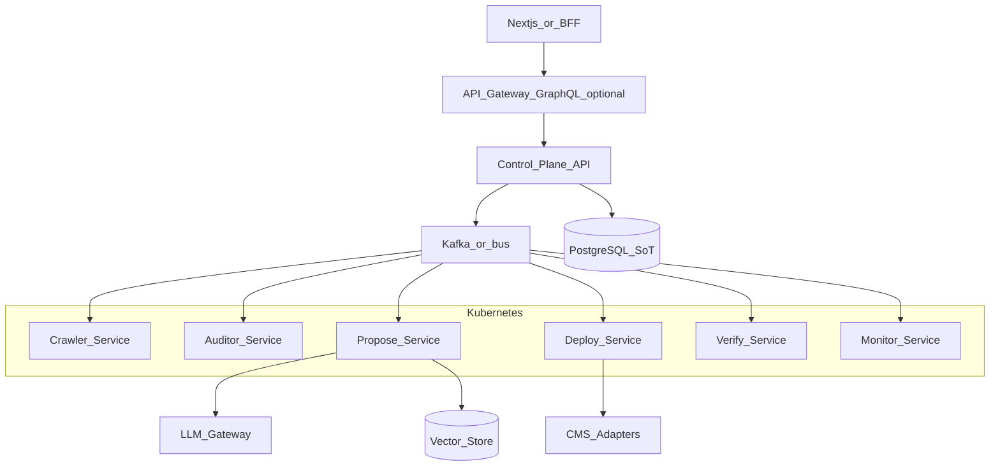

# AI-Growth-OS — Technical Requirements Document (Scale)

| Field | Value |
|-------|--------|
| **Product** | AI Growth Operating System (AI-Growth-OS) |
| **Document** | TRD-SCALE (build later) |
| **Status** | Draft v0.1 |
| **Horizon** | Phase C–D / post product-market fit |
| **Companion** | [PRD](./PRD.md) · [TRD-MVP](./TRD-MVP.md) |

> **Engineering rule:** This document is **reference-only** until [trigger criteria](#1-trigger-criteria) are met. Day-to-day implementation follows [TRD-MVP](./TRD-MVP.md). Do not pre-build Kafka, Kubernetes, or multi-region “because the scale TRD exists.”

**Positioning:** Same product — unified visibility (SEO + AEO + GEO + local + AI visibility) expanding into a full Growth OS (performance, content, conversions).

---

## 1. Trigger criteria

Adopt scale architecture when **one or more** hold:

| Trigger | Example signal |
|---------|----------------|
| Job SLO breach | Sustained queue delay; audits missing &lt;5–10 min pilot targets at higher volume |
| Concurrency | Need for hundreds+ concurrent crawls/deploys beyond one Redis/BullMQ worker pool |
| Multi-region | Enterprise contracts require data residency or &lt;X ms API latency in multiple geos |
| Security questionnaires | SSO/SAML, SOC2 Type II, Vault/HSM, private networking become deal-blockers |
| Team/size | Extracting services reduces blast radius and unlocks independent deploy cadence |
| AI/data | Citation RAG / cross-site learning needs a vector tier proven by product usage |

Until then: scale vertically, add BullMQ workers, tune crawl caps.

---

## 2. Target architecture

Evolve the modular monolith into event-driven services **without a big-bang rewrite**.



### Building blocks (when triggered)

| Concern | Scale choice |
|---------|----------------|
| Orchestration | Kubernetes, HPA, zone-aware scheduling |
| Async | Kafka (or equivalent) topics per stage |
| Internal RPC | gRPC between hot path services |
| Edge API | Keep REST; optional GraphQL BFF for complex UI |
| Mesh / CD | Istio (if needed), ArgoCD |
| Search/RAG | pgvector first; Pinecone if ops/scale justifies |
| Observability | OpenTelemetry → Jaeger/Tempo; log stack (ELK or vendor) |
| Secrets | HashiCorp Vault or cloud KMS/SM |
| Multi-region | Active-active or active-passive with clear data plane story |

CMS adapters expand beyond WordPress: Shopify, Webflow, GitHub/Next.js deploy (per PRD Phases B–C).

---

## 3. Migration path from MVP (strangler)

1. **Keep PostgreSQL as source of truth** for orgs, sites, patches, job semantics.
2. **Split workers by queue** — dedicated crawl/deploy/verify processes still on BullMQ.
3. **Introduce event topics** — emit `crawl.completed`, `audit.completed`, `deploy.applied` alongside DB writes; consumers dual-run until stable.
4. **Extract services** behind interfaces already implied by job processors (crawler, auditor, deployer, verifier).
5. **Move to K8s** when process count and release cadence hurt more than cluster cost.
6. **Add gRPC** only on high-QPS internal paths; external API stays REST/BFF.
7. **No big-bang rewrite** of Next.js/NestJS control plane until forced.

Idempotency keys and patch `before`/`after` from MVP remain the trust contract across migrations.

---

## 4. AI Growth Brain (Phase D)

Planning agent that behaves like a Growth Manager — **not an MVP feature**.

```text
Business goal
    ↓
Understand site + constraints
    ↓
Generate roadmap (weeks/months)
    ↓
Execute via existing deploy/verify loop
    ↓
Measure (rankings, citations, conversions)
    ↓
Learn → update roadmap
```

**Dependencies:** Analytics/CRM connectors, reliable verification, historical experiment memory (`AI Memory`), human approval gates for non-safe classes.

**Must not** block Phase A WordPress trust loop.

---

## 5. Business metrics platform

MVP measures scans, deploy success, uptime-ish availability, AI usage.

Scale adds customer-outcome analytics:

| Metric class | Examples |
|--------------|----------|
| Visibility | Rankings, AI citation rate, recommendation share |
| Engagement | CTR, landing engagement |
| Business | Leads, signups, revenue, calls (via connected sources) |
| Trust loop | Automatic fix success, rollback rate, time-to-first improvement |

Likely path: event stream → warehouse (BigQuery/Snowflake/ClickHouse) → customer health dashboards. Attribution will be imperfect; product copy must not guarantee revenue lift.

---

## 6. Enterprise security and readiness

| Capability | Notes |
|------------|--------|
| SSO / SAML / OIDC | Agency and enterprise tenants |
| SOC2 Type II | Process + evidence; not a YAML checkbox |
| Vault / KMS | Secret lifecycle, rotation, audit |
| Deep RBAC | Roles beyond owner/member; client-level isolation for agencies |
| Audit export | Immutable logs for compliance |
| Private networking | VPC peering / private link for enterprise crawlers if required |
| Sandbox lint/SAST | Gate code-like patches before deploy |

---

## 7. Cost and unit economics

- **Crawl cost** — bandwidth, compute, politeness limits; cap URLs per plan
- **LLM cost** — tokens per proposal; Fireworks/OpenAI routing; **BYOK** for Agency+ (customer pays model, we charge platform)
- **Verify cost** — extra fetches; still cheaper than support from bad deploys
- **Scale infra tax** — K8s/Kafka/multi-region only when revenue and SLOs justify ops overhead

Track cost per site per month as a first-class internal metric before multi-region.

---

## 8. Relationship to product roadmap

| PRD phase | TRD guidance |
|-----------|----------------|
| A — MVP | [TRD-MVP](./TRD-MVP.md) only |
| B — V1 CMS + content approve | Extend MVP monolith; new adapters |
| C — AI SoV + GitHub/Next | Consider worker split; vector/citation store if needed |
| D — Growth OS / enterprise | This TRD’s Brain, metrics warehouse, K8s/Kafka/SSO/SOC2 |

---

## Document control

| Version | Date | Notes |
|---------|------|--------|
| v0.1 | 2026-07-29 | Scale/migration TRD; companion to TRD-MVP |
